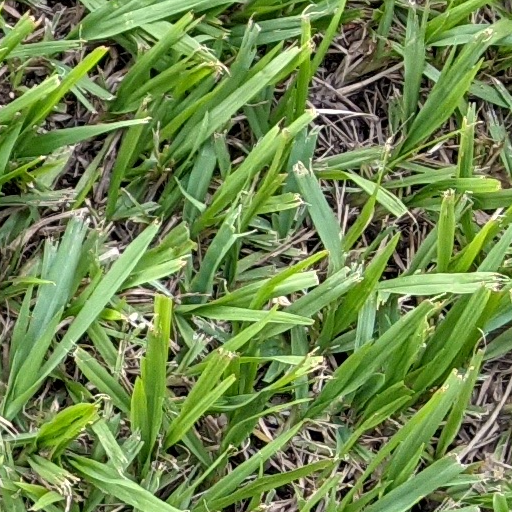
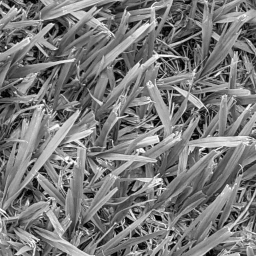
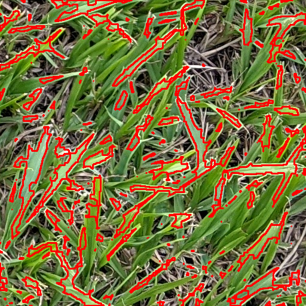
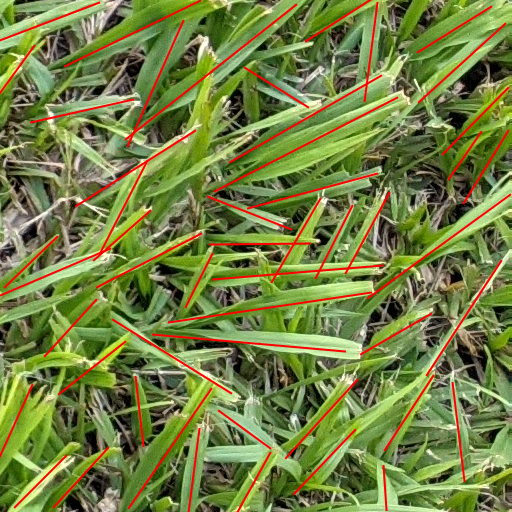
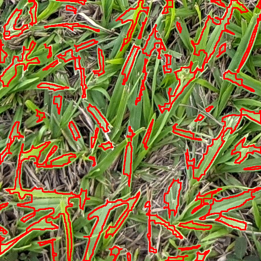

# Estimacion del cantidad tallos de grama en una imagen

### Vision Artificial 2022 - Carlos Josue Avila - carne: 20016235

## Abstracto

Este proyecto consiste en contar el numero de tallos de grama en una imagen de manera que se pueda estimar el numero de tallos de grama en un area de mayor tamaño.

Para esto se procesado imagenes de muestra de 512x512 pixeles. Estas muestras se han tomado como segmentos de imagenes de mayor tamaño.

El proceso consiste en transformaciones a la imagen de manera que se puedan encontrar contornos en la misma. 

# Procedimiento

## Toma de imagenes de muestra para analisis
Dada una fotografia de un area con grama como la siguiente:

<table><thead><tr><th>
Fotografia completa de grama - 4032x3024 pixeles
</th></tr></thead><tbody><tr><td>

</td></tr></tbody></table>

Se han tomado 7 imagenes de muestra de 512 x 512 pixeles.

<table><thead><tr><th>
Ejemplo de imagen de muestra de 512 x 512 pixeles
</th></tr></thead><tbody><tr><td>

</td></tr></tbody></table>

## Escala de grises

Cada imagen es convertida a escala de grises. Esto reduce los canales de colores a solamente uno.
<table><thead><tr><th>
Escala de grises
</th></tr></thead><tbody><tr><td>

</td></tr></tbody></table>

## Binarizacion

Luego la imagen es binarizada con un umbral del valor de la media artimetica de la imagen.

Antes de realizar la binarizacion la imagen es suavizada con un filtro de mediana. Esto remueve los detalles muy finos de la grama en la imagen y asi la binarizacion queda con menos ruido.

Como se puede observar en las imagenes siguientes cuando se binariza solamente algunas orillas tienen un poco de ruido, parece sal y pimienta.

Por otro lado cuando la imagen se suaviza antes de binarizar, el ruido se reduce y las orillas se observan mas fluidas.
<table>
<thead>
  <tr>
    <th>Solo Binarizado</th>
    <th>Suavizado + Binarizado</th>
  </tr>
</thead>
<tbody>
  <tr>
    <td></td>
    <td></td>
  </tr>
</tbody>
</table>

## Deteccion de Bordes

El siguiente paso es la deteccion de bordes. 

Este paso se considero con Canny pero los bordes resultantes no daban resultados satisfactorios por lo que se procedio con un metodo de aplicacion de mascara.

Primero se dilata la muestra binarizada (del paso anterior) con un kernel de 5x5
<table><thead><tr><th>
Dilatacion de imagen binarizada
</th></tr></thead><tbody><tr><td>

</td></tr></tbody></table>

Luego se toma la diferencia absoluta entre la imagen dilatada y la imagen binarizada. 
> La imagen binarizada actua como mascara
<table><thead><tr><th>
Diferencia absoluta: Dilatacion - Binarizacion
</th></tr></thead><tbody><tr><td>

</td></tr></tbody></table>

Finalmente se invierte el color blanco con el negro para tener una imagen resultante con areas blancas y bordes negros.
<table><thead><tr><th>
Inversion de color
</th></tr></thead><tbody><tr><td>

</td></tr></tbody></table>

## Diferenciacion de grama y no grama

El paso anterior, la deteccion de bordes, resulta en una imagen donde no se distingue que es el fondo (areas negras) y que es grama (areas blancas).

Este es un problema ya que al hacer la deteccion de contornos solamente se quiere detectar contornos que correspondan a tallos de grama - areas blancas.

Ademas de esto, algunos bordes no son continuos. Se puede observar que donde dos o mas tallos de grama se traslapan se crea un borde que es el perimetro de estos multiples tallos.

Para corregir esto se erosiona la imagen con un kernel de 7x7. Esto tiene el efecto de dilatar las areas negras.

> La funcion de dilatacion engrosa o dilata las areas blancas. La funcion de erosion adelgaza o erosiona las areas blancas. Esto es lo mismo que dilatar las areas negras.
<table><thead><tr><th>
Dilatacion de bordes negros con erosion
</th></tr></thead><tbody><tr><td>

</td></tr></tbody></table>

Luego se cubren las areas que se sabe de seguro que no son grama. 

> De la imagen binarizada se sabe que todo pixel negro no es grama asi que se utiliza nuevamente como mascara para colocar en color negro los espacios que se sabe deben ser el fondo de la imagen

<table><thead><tr><th>
Remover areas que no son grama
</th></tr></thead><tbody><tr><td>

</td></tr></tbody></table>

## Deteccion de contornos

Finalmente se buscan los contornos en la imagen. 

> Un contorno es un perimetro cerrado

Dado a que el proceso de deteccion de bordes no es perfecto se tienen algunas pequeñas areas blancas. Estas areas blancas son resultado del cruce de tallos de grama. 

Se experimento la dilatacion de bordes negros utilizando kernels mas grandes que 7x7 pero se observo que esto resultaba en la reduccion de las areas blancas que si son significativas.

Para discriminar estos contornos minusculos se consideran solamente los contornos con mas de 50 pixeles de area.

> El umbral de 50 pixeles de area se definio mediante ensayo y error

A continuacion se muestra la comparacion. Se observa que los contornos que corresponden a areas muy pequeñas han sido eliminados.

<table>
<thead>
  <tr>
    <th>Todos los contornos</th>
    <th>Contornos significativos</th>
  </tr>
</thead>
<tbody>
  <tr>
    <td></td>
    <td></td>
  </tr>
</tbody>
</table>

# Resultados

Para poder evaluar la exactitud y precision del proceso de deteccion de contornos, en la imagen de muestra se han contado los tallos de grama a simple vista y se han marcado con una linea roja.

Durante la implementacion del proceso se observo que es muy complicado detectar claramente tallos de grama individuales.

La principal dificultad es que los tallos de grama se traslapan entre si de tal manera que al binarizar la imagen se crean formas que ya no parecen tallos de grama. 

El desorden de la grama es una fuente significativa de incertidumbre en el proceso de conteo.

> Todas las transformaciones realizadas y sus metricas (como el tamaño de kernels, umbral de binarizacion, entre otros) han sido ajustados mediante ensayo y error de manera que el numero de contornos encontrados se ajuste lo mejor posible al numero de tallos de grama contados manualmente.

A continuacion se muestra la comparacion entre el valor calculado por la aplicacion y el valor esperado (los tallos contados manualmente) para cada una de las muestras.

| Muestra | Tallos esperados | Tallos calculados |
|---------|------------------|-------------------|
| 1       | 55               | 53                |
| 2       | 53               | 50                |
| 3       | 72               | 62                |
| 4       | 51               | 46                |
| 5       | 68               | 64                |
| 6       | 58               | 60                |
| 7       | 63               | 50                |

## Muestra 1
<table>
<thead>
  <tr>
    <th>Tallos de grama esperados:  55</th>
    <th>Contornos significativos calculados: 53</th>
  </tr>
</thead>
<tbody>
  <tr>
    <td></td>
    <td></td>
  </tr>
</tbody>
</table>

## Muestra 2
<table>
<thead>
  <tr>
    <th>Tallos de grama esperados:  53</th>
    <th>Contornos significativos calculados: 50</th>
  </tr>
</thead>
<tbody>
  <tr>
    <td></td>
    <td></td>
  </tr>
</tbody>
</table>

## Muestra 3
<table>
<thead>
  <tr>
    <th>Tallos de grama esperados:  72</th>
    <th>Contornos significativos calculados: 62</th>
  </tr>
</thead>
<tbody>
  <tr>
    <td></td>
    <td></td>
  </tr>
</tbody>
</table>

## Muestra 4
<table>
<thead>
  <tr>
    <th>Tallos de grama esperados:  133</th>
    <th>Contornos significativos calculados: 72</th>
  </tr>
</thead>
<tbody>
  <tr>
    <td></td>
    <td></td>
  </tr>
</tbody>
</table>

## Muestra 5
<table>
<thead>
  <tr>
    <th>Tallos de grama esperados:  68</th>
    <th>Contornos significativos calculados: 64</th>
  </tr>
</thead>
<tbody>
  <tr>
    <td></td>
    <td></td>
  </tr>
</tbody>
</table>

## Muestra 6
<table>
<thead>
  <tr>
    <th>Tallos de grama esperados:  58</th>
    <th>Contornos significativos calculados: 60</th>
  </tr>
</thead>
<tbody>
  <tr>
    <td></td>
    <td></td>
  </tr>
</tbody>
</table>

## Muestra 7
<table>
<thead>
  <tr>
    <th>Tallos de grama esperados:  63</th>
    <th>Contornos significativos calculados: 50</th>
  </tr>
</thead>
<tbody>
  <tr>
    <td></td>
    <td></td>
  </tr>
</tbody>
</table>

# Anailsis de Resultados

De los resultados obtenidos se calcula la media y desviacion para los tallos esperados y los calculados por la aplicacion en las imagenes de muestra.

| Metrica    | Tallos esperados | Tallos calculados |
|------------|------------------|-------------------|
| Media      | 60               | 55                |
| Desviacion | 7.3290           | 6.4365            |

Dado a que cada imagen de muestra es una ventana de `512x512 px` y la imagen completa tiene `4032x3024 px`, entonces en la imagen completa tiene 46.5117 ventanas que no se traslapan. Se puede pensar esto como una cuadricula con 46.5117 ventanas.

El calculo de contornos en la imagen completa resulta en `2225` contornos (tallos encontrados).

Al realizar una prueba de hipotesis con 90% de confianza (ANOVA de una sola via) con:
- Hipotesis nula: medias son iguales
- Hipotesis alterna: medias son difernetes

El resultado del ANOVA encuentra los valores:
- `F`: 1.5766
- `p`: 0.2332

<table><thead><tr><th>
ANOVA a 90% de confianza
</th></tr></thead><tbody><tr><td>

</td></tr></tbody></table>

Como el valor de `p = 0.2332` es **mayor** que la significancia `α/2 = 0.05` se puede concluir que no existe suficiente evidencia para determinar que existe una diferencia significativa entre los tallos contados por la aplicacion y los tallos contados a simple vista.

Es decir, la aplicacion puede contar los tallos de grama en una imagen con un 90% de confianza.

